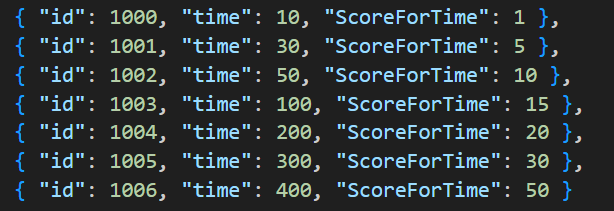
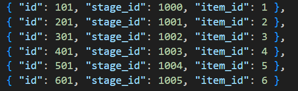
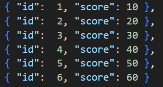

# 웹소켓 게임 만들기

### 내일배움캠프 Node 7기

---

## 구현 사항

- 스테이지 구분
- 스테이지에 따른 점수 획득 구분
- 스테이지에 따라 아이템 생성
- 아이템 획득 시 점수 획득
- 아이템 별 획득 점수 구분

---

# 1. 스테이지

유저가 플레이한 누적 시간에 따라, 스테이지 자동 이동



클라이언트의 데이터 조작 방지를 위해 스테이지 이동 여부, 다음 스테이지 확인 등의 절차는 서버에서 진행

클라이언트는 socket 을 통해 플레이 한 시간만 서버로 전송

```javaScript
 this.time = (this.time || 0) + deltaTime * 0.001;
    this.curStageId = Math.floor(this.time / 10) + 1000;

    try {
      // 서버에서 계산한 현재 스테이지 데이터 받아옴
      const curStageData = await sendEvent(10, { time: this.time });
      this.s_CurStageId = curStageData.message;
      if (!this.s_CurStageId) console.log(`s_CurStageId Missing`);
      // 서버가 계산한 현재 스테이지 로컬에 저장
      this.saveStageId = this.s_CurStageId;
    // 생략...
    }
```

```javaScript
export const getCurStageHandler = (userId, payload) => {
    // 유저의 현재 스테이지 찾는 과정 : 진행한 전체 스테이지의 목록
    const curStage = getStage(userId);
    if (!curStage) return { status: 'fail', message: 'No Stage Found For User' };

    // 현재 스테이지 id에 맞는 ScoreForTime 찾는 과정
    const currentStage = curStage[curStage.length - 1];
    const { stages } = getGameAssets();
    const stageInfo = stages.data.find((stage) => stage.id === currentStage.id);
    if (!stageInfo) return { status: 'fail', message: 'StageInfo Not Found' };

    return { status: 'success', message: currentStage.id, scoreForTime: stageInfo.ScoreForTime };
}
```

클라이언트에서 전달받은 플레이 시간을 통해 현재 플레이어의 스테이지 계산

또한 ScoreForTime 을 같이 전달해 스테이지 별 1초당 점수 추가 전달

# 2. 스테이지 이동

클라이언트에서 플레이 시간을 서버로 전달해 스테이지를 이동할 타이밍인지 확인

```javaScript
      // 스테이지 이동 타이밍 여부 계산
      const shouldStageMove = await sendEvent(11, { time: this.time });
      const isStageMoveTime = shouldStageMove.stageChanged;
      if (isStageMoveTime) {  // 이동할 타이밍이면 서버에 스테이지 이동 요청
        await sendEvent(12, {
          currentStage: this.s_CurStageId,
          targetStage: shouldStageMove.nextStageId,
          time: this.time
        });
      }
```

서버에서는 해당 값에 따라 여부 판단 및 다음스테이지 정보 전달

```javaScript
// 스테이지 이동 여부 판단을 위한 핸들러
export const shouldMoveStageHandler = (userId, payload) => {
    const curStage = getStage(userId);
    if (!curStage) return { status: 'fail', message: 'No Stage Found For User' };

    const currentStage = curStage[curStage.length - 1];
    const { stages } = getGameAssets();
    const stageInfo = stages.data.find((stage) => stage.id === currentStage.id);
    if (!stageInfo) return { status: 'fail', message: 'StageInfo Not Found' };

    const elapsedTime = payload.time;
    const stageEndTime = stageInfo.time;

    // 오차 범위 : 2초
    if (elapsedTime >= stageEndTime && elapsedTime <= stageEndTime + 2) {
        const nextStageId = currentStage.id + 1;
        // 오차 범위 내일 경우 -> 스테이지를 이동하는게 맞을 경우
        return { status: 'success', time: elapsedTime, stageChanged: true, nextStageId };
    }
    // 스테이지를 이동하는게 아닐 경우
    else return { status: 'success', time: elapsedTime, stageChanged: false };
}
```

```javaScript
export const moveStageHandler = (userId, payload) => {
    // 클라에서 전달한 currentStage 와 targetStage 할당
    const { currentStage, targetStage, elapsedTime } = payload;

    // 유저의 현재 스테이지 정보
    const currentStages = getStage(userId);
    if (!currentStages || currentStages.length === 0)
        return { status: 'fail', message: 'No Stage Found For User' };

    // 오름차순 : 가장 큰 스테이지 ID 를 확인 = 유저의 현재 스테이지
    currentStages.sort((a, b) => a.id - b.id);
    const s_CurStage = currentStages[currentStages.length - 1];

    // 클라에서 보내는 값과 비교
    if (currentStage !== s_CurStage.id)
        return { status: 'fail', message: 'Current Stage Miss' };

    // targetStage 에 대한 검증 : 게임 에셋에 존재하는 스테이지인지
    const { stages } = getGameAssets();
    const validTargetStage = stages.data.find((stage) => stage.id === targetStage);
    if (!validTargetStage) {
        return { status: 'fail', message: 'Invalid Target Stage' };
    }

    // 스테이지 갱신
    setStage(userId, targetStage, Date.now());
    return { status: "success", message: targetStage, time: elapsedTime, };
};
```

---

# 3. 아이템

현재 스테이지에 따라 아이템 종류 개수 제한

ex) 1스테이지 : item 1, 2스테이지 : item 1, item 2 ...



```javaScript
createItem(score) {
        // 현재 stageId 에 따라 생성 가능한 최대 아이템 index 계산
        const currentStageId = score.saveStageId || 1000;
        const lastTimeIndex = currentStageId - 999;
        // index 가 6을 넘어갈 경우 6으로 고정
        if (lastTimeIndex >= 6) lastTimeIndex = 6;

        // index에 따른 아이템 생성
        const index = this.getRandomNumber(0, lastTimeIndex);
        const itemInfo = this.itemImages[index];
    // 생략 ...
}
```

## .1 아이템 종류 별 점수



아이템 종류마다 존재하는 score 데이터

해당 데이터를 받아와서 현재 점수에 추가

```javaScript
  async getItem(itemId) {
    const itemScoreInfo = await sendEvent(20, { itemId });
    if (!itemScoreInfo.itemScore) console.log(`itemScore error : ${itemScoreInfo.itemScore}`);

    this.score += itemScoreInfo.itemScore;
  }
```

```javaScript
// 유저가 획득한 itemId 에 맞는 score 반환
export const itemScoreHandler = (userId, payload) => {
    const { items } = getGameAssets();
    if (!items) return { status: 'fail', message: 'No Items Founded' };

    const userGetItemId = payload.itemId;
    if (!userGetItemId) return { status: 'fail', message: 'User Get Item Id Error' };

    const itemInfo = items.data.find((item) => item.id === userGetItemId);
    console.log('itemInfoScore : ', itemInfo.score);
    if (!itemInfo) return { status: 'fail', message: 'Item Info Not Founded' };

    // 유저가 획득한 itemId 가 현재 스테이지에서 나오는 아이템인지 판단
    if (!isRightItem(userId, itemInfo.id))
        return { status: 'fail', message: 'Item Not Correct in CurrentStage' };

    const itemScore = itemInfo.score;
    return { status: 'success', itemScore };
};
```

이 안에서 유저가 보내는 itemId 가 현재 스테이지에서 나올 수 있는 itemId 인지 확인

```javaScript
// isRightItem

const isRightItem = (userId, itemId) => {
    const { stages, itemUnlocks } = getGameAssets();

    const curStage = getStage(userId);
    if (!curStage) return { status: 'fail', message: 'No Stage Found For User' };

    const currentStage = curStage[curStage.length - 1];
    const stageInfo = stages.data.find((stage) => stage.id === currentStage.id);
    if (!stageInfo) return { status: 'fail', message: 'StageInfo Not Found' };
    const currentStageId = stageInfo.id;

    const validItemids = itemUnlocks.data
        .filter((item) => item.stage_id <= currentStageId)
        .map((item) => item.item_id);

    const isValid = validItemids.includes(itemId);

    return isValid ? true : false;
};
```

---